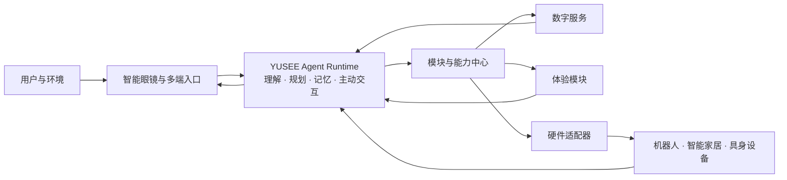

# 屿见 YUSEE

**连接智能眼镜与智能硬件的开放式 Agent 系统。**

屿见以智能眼镜作为第一视角入口，让 Agent 持续理解用户、调用数字服务，并通过桌宠机器人、智能家居与其他智能设备进入现实世界。它不是单一眼镜应用或单一机器人产品，而是位于终端、云服务与具身设备之间的 **Agent 大脑层与生态层**。

> 让眼镜看见，让 Agent 理解，让硬件行动。

## 为什么是屿见

- **完整 Agent 闭环**：从感知和理解出发，完成规划、工具调用、执行、反馈与记忆沉淀。
- **可插拔模块**：感知、记忆、工具、体验和硬件适配器可以按需安装、组合、升级或替换。
- **跨终端协同**：同一个 Agent 可以连接智能眼镜、App、机器人和智能设备，并保持一致的人格与用户上下文。
- **开放硬件边界**：设备差异由适配器处理，Agent 核心不绑定特定眼镜或机器人型号。

## 开放模块生态

| 模块类型 | 作用 | 示例 |
|---|---|---|
| 感知模块 | 为 Agent 提供用户与环境上下文 | 语音、视觉、通知、位置、设备传感器 |
| Agent 能力模块 | 扩展理解、记忆和主动行为 | 长期记忆、人格、提醒策略、任务规划 |
| 工具模块 | 连接软件与外部服务 | 日程、待办、天气、内容服务、智能家居 |
| 体验模块 | 组织完整的交互场景 | 陪伴、虚拟生活、农场、游戏、工作模式 |
| 硬件适配器 | 将统一语义动作映射到具体设备 | 表情、灯光、姿态、移动、显示、传感器 |

模块通过标准能力描述向系统注册。Agent 可以发现可用工具、检查权限、执行任务并根据真实结果继续决策；开发者无需修改 Agent 核心，即可接入新的服务、界面或硬件。

## 参考应用：屿见 Companion

屿见 Companion 展示了框架如何把个人 Agent 的数字世界与实体陪伴结合起来：用户通过眼镜和 App 看见 Agent 的状态、内心 OS 与虚拟生活，桌宠机器人则以语音、表情、灯光和动作提供现实反馈。

参考体验包括：

- 日程、待办与主动提醒；
- 个性化陪伴、状态记录与长期记忆；
- 农场、虚拟生活和轻量游戏；
- 工作、学习与生活场景中的情境协助；
- 智能家居和第三方服务联动。

当前参考实现采用智能眼镜和开源桌宠机器人验证跨端协同；框架面向主流智能眼镜、不同桌宠机器人及更多具身设备开放。

## 开源与商业模式

屿见采用 **Open Core** 模式：开放 Agent 基础框架、模块规范、协议、参考客户端与示例适配器，帮助开发者和硬件厂商快速接入；通过托管 Agent 云服务、跨设备记忆、高级功能模块、官方硬件适配、企业私有部署与 OEM 授权提供商业服务。

## 从这里开始

| 想了解 | 文档 |
|---|---|
| 产品定位、用户价值与长期愿景 | [产品与愿景](docs/01-产品与愿景.md) |
| Agent 架构、模块体系与部署形态 | [Agent 架构与模块生态](docs/02-Agent架构与模块生态.md) |
| 开发工具、体验模块或硬件适配器 | [开发者接入指南](docs/03-开发者接入指南.md) |
| 查看陪伴、提醒、游戏和智能生活案例 | [参考应用与体验](docs/04-参考应用与体验.md) |

欢迎开发者通过 Issues 与 Pull Requests 参与模块、适配器和参考应用共建。
