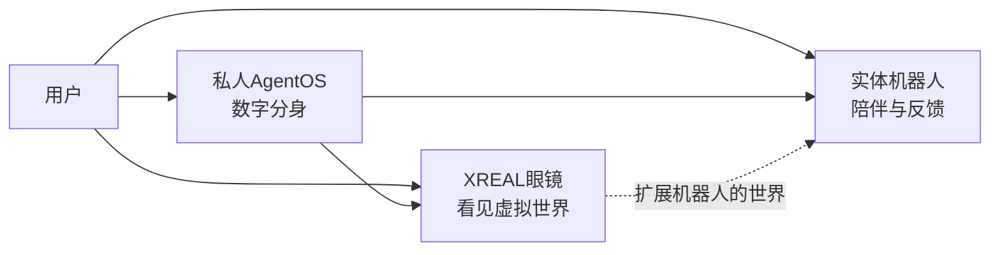
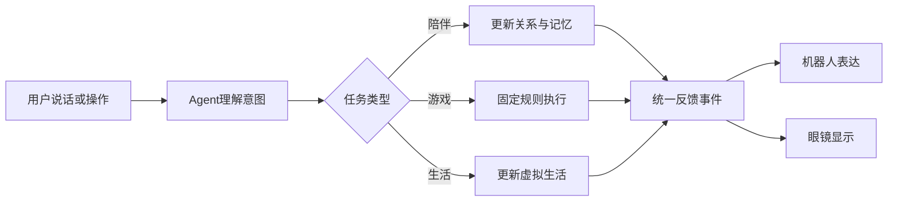

# 空间伙伴项目 PRD

> 本文只定义产品目标、用户体验与首版范围。技术选型见《技术架构与可行性方案》，人员排期见《两周开发计划》。

## 1. 产品定义

这是一个由**私人 AgentOS、StackChan 实体机器人、XREAL 眼镜和 Beam Pro**共同组成的虚实融合 AI 伙伴。

- AgentOS 是用户在电子世界中的私人分身，保存经授权的记忆、偏好和生活状态。
- StackChan 是 AgentOS 在现实中的陪伴化身，也是用户在场时最高优先级的反馈实体。
- XREAL 眼镜让用户看见机器人所在的虚拟生活和游戏世界。
- Beam Pro 承载 AR 应用，并协调眼镜、机器人和 AgentOS。

## 2. 产品目标

1. 让实体机器人、虚拟角色和 Agent 始终表现为同一个伙伴。
2. 让机器人拥有持续的生活、关系和记忆，而不是一次性对话设备。
3. 用 AR 游戏和实体演出形成可感知的虚实互动。
4. 两周内完成可稳定演示的最小版本，并为多人多机和长期升级保留空间。

## 3. 产品原则

- **机器人优先：**用户在场时，重要反馈优先通过机器人表达，眼镜补充详细信息。
- **眼镜扩展：**眼镜用于进入机器人世界，不只是显示手机画面。
- **状态统一：**机器人表情、AR动画、游戏结果和 Agent 记忆来自同一状态。
- **规则确定：**游戏由固定规则判定，AI只负责理解、讲解和陪伴反馈。
- **可降级：**断网、未佩戴眼镜或 AI 不可用时，基础机器人和游戏仍可运行。
- **数据私有：**身份、记忆和生活数据由用户控制。

## 4. 核心场景

| 场景 | 用户体验 | 首版范围 |
|---|---|---|
| 一人一机 | 对话陪伴、查看虚拟生活、玩游戏、接收提醒 | 完整实现 |
| 多人多机 | 多只宠物相遇、共同游戏、聚会引导 | 保留设计与接口，暂不做正式联机 |
| 人机分离 | 用户离开后宠物继续生活，回来后汇报经历 | 采用离线进度补算，不要求机器人持续物理活动 |

### 单人游戏关系

快艇骰子是用户与宠物对战。不设额外裁判或 NPC。游戏系统负责固定规则、合法操作和计分；宠物负责参与游戏、回应结果和陪伴互动。

种菜是用户与宠物共同经营。不设任务发布角色。用户和宠物共同完成种植、照料和收获；游戏系统负责状态推进和结果计算。

单人游戏使用“游戏伙伴”“互动台词”“引导与反馈”。Agent 或宠物不能改变固定规则和游戏结果。多人聚会场景可以保留聚会引导，但不与单人游戏混写。具体规则由 C 定义。

## 5. 核心功能

| 模块 | 首版能力 |
|---|---|
| 实体陪伴 | 表情、声音、灯光、转头、触摸反馈和简单移动 |
| AR世界 | 展示虚拟角色、生活空间、种植内容和桌面游戏 |
| 私人AgentOS | 人格对话、意图理解、基础长期记忆和工具调用 |
| 虚拟生活 | 心情、精力、亲密度、种植、随机生活事件和回归汇报 |
| 快艇骰子（类似Yahtzee） | 投掷与保留骰子、组合计分及机器人互动反馈 |
| 种菜 | 播种、成长、浇水、收获及状态提醒 |
| 语音交互 | 语音输入、字幕、语音回复和打断 |
| 生活助手 | 事项与休息提醒；智能家居作为可选演示能力 |

## 6. 关键体验流程

典型流程包括：首次绑定、日常对话、进入 AR 世界、完成一局游戏、种植与收获、离开后回归、异常降级。

## 7. 首版范围

### 必须完成

- StackChan 与 Beam Pro 的稳定联动。
- XREAL 中可见的机器人虚拟世界。
- Agent 人格、基础记忆和语音交互。
- 虚拟生活基础状态与离线补算。
- 快艇骰子和种菜两个完整闭环。
- 实体、AR、Agent 和游戏状态同步。
- 移动底座的低速控制与安全停止；硬件未及时完成时允许降级演示。

### 暂不实现

- 正式多人服务器和远程多人游戏。
- 全屋巡航、视觉 SLAM、自动回充。
- Beam Pro 本地运行重型大模型或实时视觉模型。
- 电脑 Agent 任务联动。
- 完整手机 Companion App。

## 8. 验收标准

- 用户无需开发工具即可完成核心演示流程。
- 两款游戏均可脱离 LLM 从开始运行到正确结算。
- 同一情绪或游戏事件能同步驱动机器人与 AR 表现。
- 退出或重启后，宠物状态、游戏进度和关键记忆可恢复。
- AI、网络或眼镜异常不会导致底座持续移动或游戏状态损坏。
- 完整 Demo 可连续、重复演示。

## 9. 待确认

- “完全私有”是否允许调用外部 LLM、ASR 和 TTS，仅将身份、记忆及状态保存在私人环境。
- 移动底座最终控制板、通信接口和供电方案。
- 比赛提交规格、演示时长和最终截止时间。
