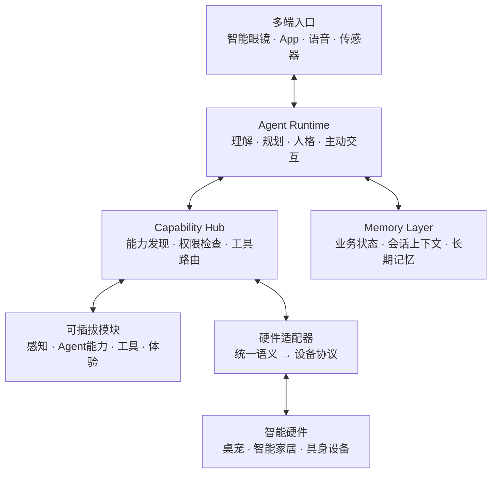

# Agent 架构与模块生态

屿见（YUSEE）是连接智能眼镜、数字服务与智能硬件的开放式 Agent 系统。系统把设备差异封装在模块和适配器中，使个人 Agent 可以在不同终端上延续同一份身份、上下文和能力。

本文说明屿见的开放架构与扩展规范。具体眼镜和机器人只作为参考实现，不构成框架限制。

## 1. 架构目标

- **以 Agent 为核心**：理解用户目标、规划任务、调用工具、检查结果并持续交互。
- **终端与能力解耦**：更换眼镜、机器人或服务时，不改动 Agent 核心。
- **模块按需组合**：感知、工具、体验、人格和硬件能力可以独立安装、升级与移除。
- **数据持续一致**：业务事实、短期上下文和长期记忆各有明确职责。
- **部署方式可选**：支持本地设备、家庭服务器与托管云服务。

## 2. 总体架构



系统不把某个终端视为唯一中心：眼镜负责第一视角感知和轻量反馈，App 负责完整交互与管理，智能硬件负责现实世界中的表达与行动，Agent Runtime 负责跨端理解与决策。

## 3. Agent Runtime

Agent Runtime 是系统的“大脑层”，围绕一次任务形成完整闭环：

```text
接收上下文 → 理解目标 → 形成计划 → 选择工具
→ 执行与观察结果 → 必要时修正 → 多端反馈 → 更新状态与记忆
```

它主要包含以下职责：

| 能力 | 作用 |
|---|---|
| 上下文管理 | 合并对话、日程、设备状态和用户授权的环境信息 |
| 意图与任务理解 | 区分问答、提醒、控制、游戏和多步骤任务 |
| 规划与执行 | 将目标拆分为可调用工具，并依据执行结果继续决策 |
| 人格与表达 | 决定语气、内心 OS、情绪和多端表现方式 |
| 主动行为 | 根据时间、状态和触发规则发起合适的提醒或互动 |
| 记忆编排 | 读取相关记忆，并将值得保留的经历写入记忆层 |

确定性业务规则由对应模块执行，例如日程写入、游戏判定和设备安全限制；Agent 负责理解、编排与交付结果，不以生成内容代替真实执行。

## 4. Capability Hub 与 MCP

Capability Hub 是 Agent 与外部能力之间的统一入口，负责：

- 注册和发现当前可用模块；
- 向 Agent 暴露结构化工具及其使用说明；
- 检查用户授权、设备能力和运行条件；
- 将调用路由到本地模块、云端服务或硬件适配器；
- 返回可验证的执行结果和错误信息。

MCP 是软件工具接入的重要标准接口。第三方模块也可以通过兼容适配层接入，Agent 面向的是统一能力描述，而不是某个服务的私有调用方式。

工具执行必须返回实际结果。超时、权限不足、设备离线或执行失败时，系统应明确告知 Agent，不将“已发送”视为“已完成”。

## 5. 五类可插拔模块

| 类型 | 职责 | 示例 |
|---|---|---|
| 感知模块 | 将外部信息转成带来源和时间的上下文 | 语音、第一视角画面、消息通知、位置、设备传感器 |
| Agent 能力模块 | 扩展理解、规划、人格和主动行为 | 记忆策略、人格模板、提醒策略、任务规划 |
| 工具模块 | 调用数字服务并返回结构化结果 | 日程、待办、天气、新闻、智能家居 |
| 体验模块 | 组合规则、内容、状态和多端表现 | 陪伴、农场、游戏、学习、工作模式 |
| 硬件适配器 | 将统一语义动作映射到具体设备协议 | 表情、灯光、转头、移动、屏幕、传感器 |

模块之间通过声明的能力和事件协作，不直接依赖彼此的内部实现。一个体验模块可以组合多个工具和硬件能力；缺少某项硬件时，也可以选择兼容的反馈方式。

## 6. 模块清单

每个模块通过清单描述自身能力。基础字段如下：

```yaml
id: org.example.module
name: Example Module
version: 1.0.0
capabilities: []
tools: []
permissions: []
ui_slots: []
hardware_requirements: []
dependencies: []
```

| 字段 | 含义 |
|---|---|
| `capabilities` | 模块能够提供的语义能力 |
| `tools` | Agent 可以发现和调用的工具 |
| `permissions` | 摄像头、通知、位置、硬件控制等授权要求 |
| `ui_slots` | App 页面、眼镜卡片、快捷入口等界面扩展位 |
| `hardware_requirements` | 必需或可选的设备能力 |
| `dependencies` | 运行所需的模块、服务和兼容版本 |

模块清单既用于运行时发现，也用于安装前展示权限和依赖，避免模块在未说明的情况下读取数据或控制设备。

## 7. 硬件语义适配层

Agent 不直接发送电机转速、引脚值或厂商私有指令，而是调用统一语义能力，例如：

```text
表达开心　看向用户　播放提醒　显示内容
低速前进　停止移动　读取姿态　获取设备状态
```

硬件适配器负责：

1. 描述设备支持的能力和限制；
2. 将语义动作转换为具体协议；
3. 执行限速、限位、超时停止等本地安全规则；
4. 回传动作结果、传感器观察和设备状态；
5. 在断连或异常时进入安全状态。

因此，新接入一种眼镜、桌宠机器人或智能设备时，主要工作集中在适配器，不需要重写人格、记忆和任务编排。

## 8. 多端反馈

同一事件可以根据内容和场景分配到不同信息通道：

| 信息类型 | 适合的反馈方式 |
|---|---|
| Agent 正式回复 | 语音、字幕或 App 对话 |
| 内心 OS | 眼镜与 App 中的轻量文本 |
| 重要提醒 | 眼镜通知、机器人表达与 App 记录 |
| 游戏反馈 | 场景画面、音效和实体动作 |
| 情绪表达 | 表情、灯光、姿态和声音 |
| 详细配置 | App 的完整页面 |

通道策略由体验模块决定，并受场景、权限和终端在线状态约束。必要信息应保留可回看的记录，瞬时表达则优先选择眼镜和实体硬件。

## 9. 记忆与数据

记忆层按数据性质分工：

| 数据层 | 保存内容 | 原则 |
|---|---|---|
| 业务事实 | 日程、游戏进度、家园状态、授权和设备关系 | 可精确读写，作为业务真相来源 |
| 会话上下文 | 当前任务、最近对话和临时观察 | 服务于本轮推理，按策略过期 |
| 长期记忆 | 偏好、经历、关系和可检索摘要 | 用于个性化，不覆盖业务事实 |
| 实时设备状态 | 在线状态、传感器观察和动作结果 | 带来源与时间，避免使用过期状态 |

数据接口与具体存储实现解耦。用户可以查看、导出和删除自己的数据；模块只能读取获得授权且完成任务所必需的范围。

## 10. 部署形态

| 形态 | 适用场景 | 特点 |
|---|---|---|
| 本地模式 | 单设备体验、离线环境和隐私敏感场景 | 核心数据与能力留在用户设备附近 |
| 家庭服务器模式 | 多终端、桌宠和智能家居协同 | 提供家庭内常驻 Agent 与统一状态 |
| 托管云服务 | 跨网络同步、弹性模型和持续服务 | 降低部署门槛，按授权连接用户终端 |

三种形态共享模块规范和能力接口，可以根据算力、隐私、时延和成本组合本地与云端能力。

## 11. 权限与安全

- 摄像头、麦克风、通知、位置和个人数据均需明确授权；
- 模块安装前展示权限、数据用途和外部依赖；
- 涉及移动、门锁等高风险动作时增加确认与本地安全限制；
- Agent 记录工具调用及其真实结果，便于用户理解和追溯；
- 用户可以停用或卸载模块，并撤销对应权限；
- 硬件失联、服务异常或结果不确定时，默认采取安全降级。

## 12. 参考实现

屿见 Companion 是该架构的首个参考应用，组合智能眼镜客户端、个人 Agent、陪伴与游戏模块，以及桌宠机器人适配器，展示数字世界与实体反馈的协同方式。

当前仓库以 XREAL 智能眼镜和 StackChan 开源桌宠机器人作为参考适配对象。它们用于说明模块如何接入，不限定屿见对其他主流眼镜、桌宠机器人、智能家居和具身设备的兼容方向。

