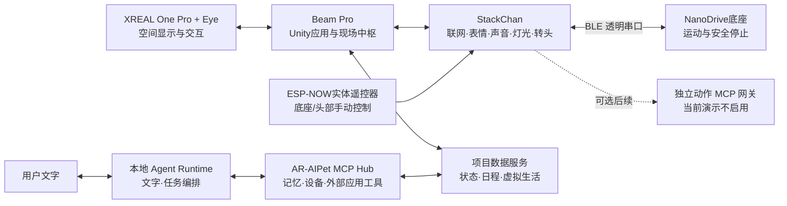
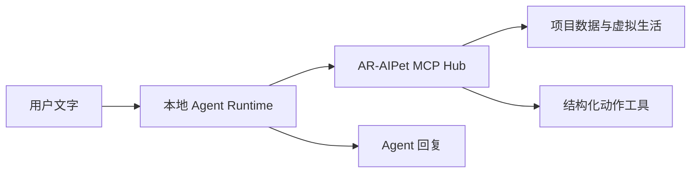
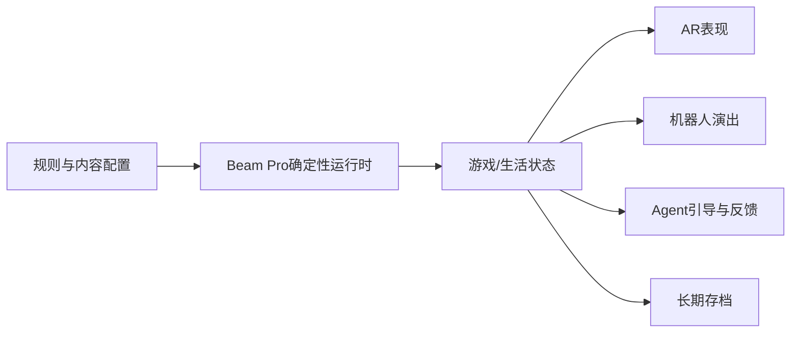
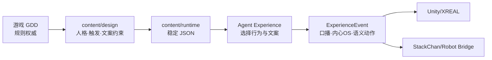
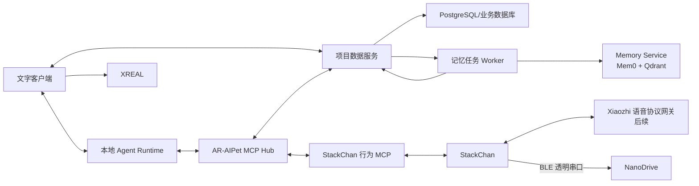

# 技术架构与可行性方案

> 本文只说明系统如何实现、哪些能力已确认、哪些需要验证。产品需求见《项目 PRD》，任务排期见《两周开发计划》。

> 当前比赛版本的实现顺序与首版边界以[《首版实现边界与技术决策》](08-首版实现边界与技术决策.md)为准；本文其余内容保留为完整演进架构与可行性参考。

## 1. 决策状态

- **已确认：**设备或方向已经确定。
- **提议采用：**当前推荐，PoC 后冻结。
- **待验证：**必须通过实机测试确认。
- **后续：**不进入两周首版。

## 2. 总体架构



Beam Pro 只连接项目数据服务，不承担机器人驱动。当前演示由 StackChan 的 Xiaozhi 主语音会话调用本体 Emoji、灯光和头部工具；底座由 ESP-NOW 实体遥控器控制，StackChan 再通过 BLE 透明串口驱动 NanoDrive。独立动作 MCP 网关保留为后续扩展，不是当前演示链路。NanoDrive 不需要自带 Wi-Fi；移动安全必须在底座本地生效。

## 3. 模块职责

| 模块 | 主要职责 | 状态 |
|---|---|---|
| XREAL + Eye | AR显示、头部追踪和可用的相机/空间能力 | 硬件已确认，能力组合待验证 |
| Beam Pro | Unity渲染、输入、游戏运行、设备控制和现场状态 | 已确认 |
| StackChan | 实体表达、触摸和基础本地响应 | 实体启动、核心外设、中文唤醒词与 BASE 遥控已验证；StackChan—BLE—NanoDrive v0.9 已实体通过；Beam Pro—StackChan 与项目 Agent 服务接入仍待验证 |
| 移动底座 | NanoDrive、编码器、PID、低速移动和停止 | 基础移动、停止、断连/输入超时保护已实体通过；SLAM、避障和自动回充后续扩展 |
| AgentOS | 本地 Agent Runtime、项目工具、记忆和生活状态 | Mock 文字与记忆闭环已通过；真实模型、真实 Mem0 和语音网关后续接入 |
| 外部服务 | LLM、ASR、TTS和Home Assistant | 按隐私要求选择 |

## 4. Beam Pro与XREAL方案

提议使用 **Unity + [XREAL SDK](https://docs.xreal.com/) + [UniVRM](https://github.com/vrm-c/UniVRM)**。Beam Pro 负责 AR 渲染、确定性游戏和本地设备协调，复杂 AI 推理放在 AgentOS 服务端。

首轮必须验证：

1. One Pro + Eye 可用的追踪和图像能力。
2. AR、VRM、语音、网络和设备连接并发运行的性能。
3. 眼镜断开、应用切后台和恢复后的状态保持。
4. 虚拟内容与实体机器人附近位置关系的稳定程度。

追踪不足时，依次降级为视觉校正、初始手动对齐和相对固定展示，不阻塞其他功能。

## 5. StackChan与移动底座

StackChan 复用已有表情、声音、灯光、转头和触摸能力，Beam Pro 只发送语义动作，例如 `happy`、`nod`、`speak`、`stop`。

底座采用 ¥99 NanoDrive 方案：Arduino Nano 主控、串口指令、编码器/PID示例和扩展IO。商家提供原理图，完整源码未确认；现有示例足够首版修改使用。

底座统一暴露以下最小接口：

```text
forward / backward / turn_left / turn_right / stop / get_state
```

底座必须具备：启动默认静止、低速限制、指令超时停止、断连停止和物理断电。编码器闭环、避障和自动回充不作为首版前提。

真实底座到货前，使用相同调用方式的 `MockBaseAdapter` 开发上层功能；它只模拟底座，不模拟整个机器人。电池采用商家确认的配套方案，并补充确认充电方式。

## 6. AgentOS与数据

当前采用项目自有本地 Agent Runtime，通过 AR-AIPet MCP Hub 调用项目工具；Xiaozhi/StackChan 固件继续提供设备语音和实体能力，语音协议网关后续接入。**Demo 语音通道为 StackChan 侧 Xiaozhi 语音会话**（已按 `docs/10` 验收），语音协议网关"后续接入"指 StackChan 语音与本地 Agent Runtime 的协议级集成，不影响 Demo 用 Xiaozhi 语音作为展示通道（见 `docs/08` 技术决策）。



- 身份、宠物状态、游戏进度等确定性数据使用结构化存储。
- Mem0 只保存适合语义检索的长期记忆，不保存游戏胜负和关键数值；当前由 Memory Worker 异步写入，Mock 已通过，真实 Mem0 待凭据验证。
- Agent 只能调用 MCP 白名单工具；危险操作需要确认。
- 外部模型不可获得未授权的完整个人数据。

## 7. 游戏与虚拟生活



- 规则、数值和事件以结构化配置输入。
- 快艇骰子由用户与宠物对战；不设额外裁判或 NPC。投掷、保留、计分选择和结果由 Beam Pro 的游戏系统确定性执行，宠物只参与游戏、回应结果和陪伴互动。
- 种菜由用户与宠物共同经营；不设任务发布角色。用户和宠物共同完成种植、照料和收获，游戏系统负责状态推进和结果计算。
- 虚拟生活由服务端按时间推进；首版在人机重连后补算离线事件。
- Agent 只能提供互动台词、引导与反馈，不能改变固定规则、合法操作、计分或结果。
- 当前局快照保存在 Beam Pro，跨会话历史和宠物长期状态保存在 AgentOS。

### 7.1 内容与体验编排层

首版正式内容位于 [`content/design/`](../content/design/) 与 [`content/runtime/`](../content/runtime/)：

- `personas.json` 定义人格表达、主动程度和行为权重；`behaviors.json` 定义触发、冷却、优先级和语义动作。
- `dialogue-lines.json` 与 `inner-os-lines.json` 分别供口播和 XR/Beam Pro 内心 OS 使用；缺失或校验失败时回退到规则模板。
- `yahtzee.json` 与 `farming.json` 是运行时规则基线，和 GDD 一致；Agent 只编排，不计算骰子、改分数或改农场结算。
- 内容 ID 是稳定接口；A/B 只消费 JSON，C 后续修改须保持 ID 或提升版本。



## 8. 通信与降级

| 链路 | 建议方式 | 断开后的处理 |
|---|---|---|
| Beam Pro—StackChan | 局域网双向连接 | 自动重连，保留机器人本地交互 |
| StackChan—NanoDrive | BLE 透明串口 | 立即停止 |
| Beam Pro—项目数据服务 | WebSocket | 当前游戏继续，数据恢复后重新同步 |
| Xiaozhi Agent—MCP Hub | 标准 MCP 连接 | 保留基础对话，明确告知工具暂不可用 |
| MCP Hub—外部服务 | 对应 MCP/API | 返回明确失败，不伪造执行成功 |

所有动作带事件 ID，重复事件不得执行两次；游戏和设备事件应可记录与回放。

## 9. 开源复用

下列项目均为候选方案，当前状态为待验证；实际结论只在《开源项目验证清单》中填写。

| 用途 | 首选 | 采用方式 |
|---|---|---|
| 机器人 | [M5Stack官方StackChan](https://github.com/m5stack/StackChan) | 直接调试并封装现有接口 |
| XR | [XREAL SDK](https://docs.xreal.com/) | 官方能力直接接入 |
| 角色 | [UniVRM](https://github.com/vrm-c/UniVRM) | 直接采用 |
| Agent | 项目内本地 Agent Runtime | 文字会话和 MCP 工具编排；Xiaozhi 保留为设备语音能力 |
| MCP Hub | [FastMCP](https://github.com/jlowin/fastmcp) | 采用；当前提供项目状态与日程工具 |
| 记忆 | [Mem0](https://github.com/mem0ai/mem0) + [Qdrant](https://qdrant.tech/documentation/) | 自托管；Mock Worker 已通过，真实 LLM/Embedding 待验证 |
| Unity通信 | [NativeWebSocket](https://github.com/endel/NativeWebSocket)等成熟库 | 直接采用 |
| 智能家居 | [stackchan_ha_addons](https://github.com/rudyll/stackchan_ha_addons)、[Home Assistant](https://github.com/home-assistant/core) | 可选复用 |
| 底座控制 | NanoDrive商家示例；[Nova Bot](https://github.com/prasodium/nova-bot) | 商家示例直接修改；Nova Bot只参考安全设计 |

详细体验、版本、许可证和调试结论另存《开源项目验证清单》。

## 10. 可行性判断

| 能力 | 判断 | 关键条件 |
|---|---|---|
| StackChan实体联动 | 高 | 获得实际控制接口 |
| AR虚拟角色与场景 | 高 | Beam Pro性能满足基本负载 |
| 两款确定性游戏 | 高 | 控制内容规模 |
| Agent对话与记忆 | 高 | 使用服务端模型 |
| 虚拟生活与离线补算 | 高 | 不要求永久实时运行 |
| 语音交互 | 中高 | 网络与回声处理可接受 |
| 基础移动底座 | 高 | NanoDrive BLE 透明串口与 PID 示例已实体通过 |
| 动态实体精确AR跟踪 | 中 | 取决于Eye能力和实际环境 |
| 正式多人多机 | 中 | 后续增加权威同步服务 |
| SLAM与自动回充 | 低于首版需求 | 需要额外传感器和长期调试 |

## 11. 首轮验证顺序

1. StackChan—NanoDrive 实体控制已通过；下一步验证 Beam Pro/XREAL 追踪与现场负载。
2. XREAL追踪、Eye能力与Beam Pro综合负载。
3. Unity游戏运行时和设备动作统一事件。
4. Agent结构化工具调用、记忆与虚拟生活持久化。
5. 语音、AR、机器人和游戏的端到端闭环。

完成以上验证后再增加非核心功能，避免同时排查多层故障。

## 12. 首版实际数据流



Unity App 通过 WebSocket 读写项目数据服务；本地 Agent Runtime 通过 MCP Hub 调用业务和设备工具，并从 Memory Service 检索长期记忆。PostgreSQL 是业务事实来源，Mem0 由 Worker 异步派生；Memory Worker 只能通过数据服务 WebSocket 读写任务和 `memory_refs`。当前文字闭环为 `用户文字 → Agent Runtime → MCP Hub → DataServiceClient → WebSocket 数据服务 → PostgreSQL → Agent 回复`，长期记忆检索为 `Agent Runtime → Memory Service → Mem0/Qdrant`。Xiaozhi/StackChan 语音协议网关后续接入。

当前体验编排在文字闭环之上增加：`AgentTurnResult → ExperienceEvent → Mock Unity/Robot → ActionResult → DataService/PostgreSQL`。Persona 与行为规则从 `content/runtime/` 加载，主动日程和农场事件由 Agent Runtime 的规则调度器触发；这仍不代表真实 Unity、StackChan 或底座已经接入。

## 13. 实现现状与连接拓扑（防止命名混淆，集中说明）

> 本节是"当前实际跑什么、各叫什么、连谁"的单一参考。架构演进和可行性见上文第 2—7 节；历史决策见 [docs/08](08-首版实现边界与技术决策.md)、[docs/10](10-方案B验证记录.md)。本节随基线变更更新。

### 13.1 物理部署（谁在哪台机器）

| 机器 | 跑什么 | 来源 |
|---|---|---|
| 电脑（局域网主机） | `services/agent-service`：7 独立服务（postgres / data-service:8080 / mcp-hub:8081 / agent-runtime:8082 / robot-bridge / memory-service:8083 / qdrant） | main 现状 |
| 电脑（分支 WIP，未进 main） | 统一 `ar-aipet-server`：:8090 一个进程承载上述全部 | `feat/real-robot-loop` 分支，Mock 验证通过 |
| StackChan（ESP32-S3） | `firmware/stackchan-mcp`（21ab6636）：Kimito 行为层 + AI.AGENT/Xiaozhi 语音 + 设备固件 MCP + BLE 底座控制 | 当前产品固件 |
| 底座（Arduino Nano） | `firmware/nanodrive`：电机/编码器/看门狗 | v0.9 实体验收 |
| 遥控器（ESP32） | `firmware/espnow-controller`：ESP-NOW 发，4 模式 | 实机验收 |

### 13.2 连接方向与端口

| 入口 | 方向 | 谁连谁 | 说明 |
|---|---|---|---|
| `:8080/ws` | 设备→电脑 | 设备主动连 data-service | 直连方案（历史） |
| `:8765` | 设备→电脑 | StackChan 主动连 Gateway | Scheme B 设备侧 |
| `:8767/mcp` | 电脑→网关 | Robot Bridge 调 Gateway | Scheme B 项目侧 |
| `:8090` | — | 统一服务（分支 WIP） | 未进 main |

**关键**：`:8080` 直连与 `:8765/8767` 网关**连接方向不同，证据不能互迁**（见 [docs/10](10-方案B验证记录.md) 边界段）。

### 13.3 三个 Gateway 与三类 MCP（都叫 Gateway/MCP，不同层）

**三个 Gateway：**

| Gateway | 位置 | 职责 |
|---|---|---|
| `agent_gateway` | 电脑（ar-aipet-server 内） | Agent WebSocket 入口，管对话 + 体验接纳 |
| stackchan-mcp Gateway | 电脑（:8765/:8767） | 可选的独立动作 MCP 工具网关，当前演示不启用 |
| Kimito gateway | 电脑（Node.js） | Kimito 行为层动作网关 |

**三类 MCP（共用 MCP 协议，角色相反）：**

| MCP | 位置 | 角色 | 做什么 |
|---|---|---|---|
| 服务端 MCP Hub | 电脑（FastMCP） | 工具箱 | Agent 查数据/日程/农场（读库，经 DataServiceClient） |
| 设备端 McpActionClient | 机器人（C++） | 可选客户端 | 主动连 :8765 收动作指令，转设备 MCP 执行；当前 `xiaozhi-voice-only` 不启动 |
| 设备固件 MCP | 机器人（StackChan 自带） | 设备能力 | 控屏幕/表情/舵机/底座（**保留不合并**） |

动作网关扩展链路（后续启用时）为：**服务端 Adapter（发）→ 网络 /ws/device → 设备 McpActionClient（收）→ 设备 MCP 执行**。当前演示不依赖这条链路，语音动作直接由 StackChan 主会话内置工具执行。

### 13.4 基线现状（当前 vs 历史）

| 固件 | commit | 定位 | 能力 |
|---|---|---|---|
| stackchan-mcp（kit 方案） | `21ab6636` | **当前产品固件基线** | `xiaozhi-voice-only`：语音/表情/头部/ESP-NOW 遥控/BLE v0.9；独立动作网关为可选补丁 |
| Mooncake | `b72b3ede` | **历史实验**（2026-08-05，已废弃） | 仅硬件初始化，无底座工具，供硬件基线参照 |
| Kimito 行为层 | `bc15929` | 主机侧行为层（非固件） | Python/Node，表情/陪伴反馈 |

设备实际跑的是 stackchan-mcp（或其混合中间版）。`sourceMatch: not proven` 表示源码待在干净 clone 上 apply 补丁 + 编译复现，**非源码缺陷**（代码从 github 拉锁定 commit，apply 项目补丁 0001-0007 后才是设备固件）。Mooncake 不再扩展产品功能。

### 13.5 术语对照（易混词）

| 词 | 含义 |
|---|---|
| 方案 B | ① 底座连接方式（独立 ESP32）→ ② 固件架构（Kimito + stackchan-mcp，独立 Gateway 可选）→ ③ 连接协议（scheme-b，设备发 hello+mcp）。当前演示只采用固件本体语音和实体遥控器 |
| Scheme B vs scheme-b | 架构名（大写）vs 设备连接协议名（小写） |
| Agent | 本地 AgentRuntime（电脑，文字管家）/ AI.AGENT（机器人上的 app，打开才启动 Xiaozhi）/ Xiaozhi（语音服务，ASR/TTS/对话） |
| Robot Bridge vs Adapter | Bridge=外壳（调度/优先级/回传）；Adapter=内芯（把意图翻译成指令执行） |
| Adapter vs McpActionClient | 电脑侧**发** vs 机器人侧**收** |
| ExperienceHub vs Orchestrator | Hub=准入事件（优先级抢占，先判定再落库）；Orchestrator=造事件（选人格、回合转事件） |
| data-service vs DataServiceClient | data-service=服务端（唯一连 PostgreSQL）；DataServiceClient=客户端（别的服务用它调 data-service，不碰库） |
| ESP-NOW vs BLE | ESP-NOW=遥控器→StackChan（2.4G 直连，24 字节帧）；BLE=StackChan→底座（蓝牙透传 FFE1，转成 UART 指令） |
| Alembic vs db | Alembic=数据库表结构版本管理（`migrations/versions/0001_mvp_schema.py` 建全部 10 表，唯一出处）；db.py/server.py=业务查询（0 个 CREATE TABLE） |
| content design vs runtime | design=人写规则源（Markdown）；runtime=程序读的版本（JSON）。design→runtime 是权威链，Agent 不改规则 |
