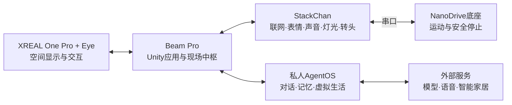
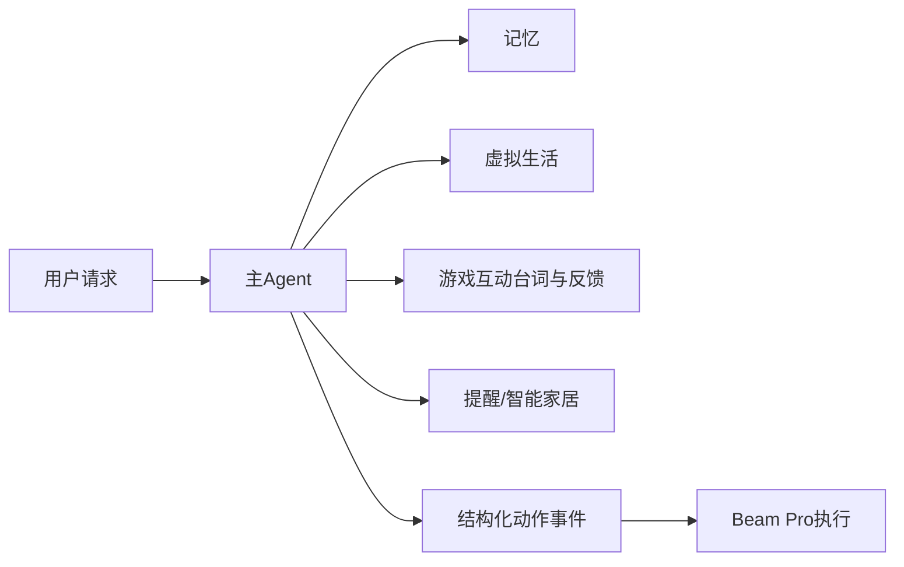
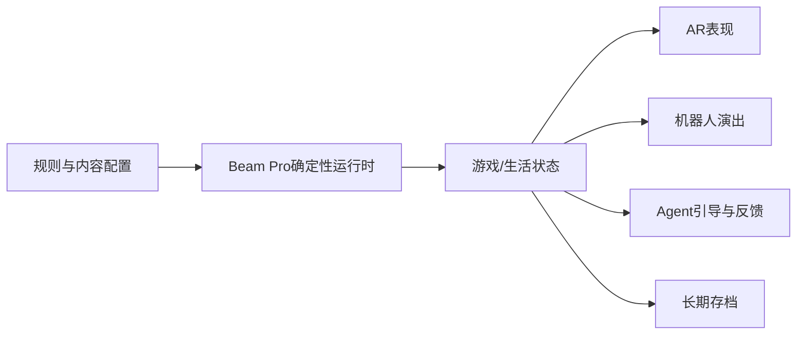
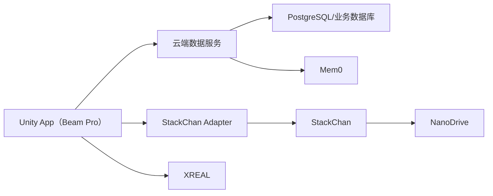

# 技术架构与可行性方案

> 本文只说明系统如何实现、哪些能力已确认、哪些需要验证。产品需求见《项目 PRD》，任务排期见《两周开发计划》。

> 当前比赛版本的实现顺序与首版边界以[《首版实现边界与技术决策》](08-首版实现边界与技术决策.md)为准；本文其余内容保留为完整演进架构与可行性参考。

## 1. 决策状态

- **已确认：**设备或方向已经确定。
- **提议采用：**当前推荐，PoC 后冻结。
- **待验证：**必须通过实机测试确认。
- **后续：**不进入两周首版。

## 2. 总体架构



Beam Pro 通过 Wi-Fi 控制 StackChan，StackChan 再通过串口控制 NanoDrive。NanoDrive 不需要自带 Wi-Fi。AI 服务不可直接持续控制电机，移动安全必须在底座本地生效。

## 3. 模块职责

| 模块 | 主要职责 | 状态 |
|---|---|---|
| XREAL + Eye | AR显示、头部追踪和可用的相机/空间能力 | 硬件已确认，能力组合待验证 |
| Beam Pro | Unity渲染、输入、游戏运行、设备控制和现场状态 | 已确认 |
| StackChan | 实体表达、触摸和基础本地响应 | 实体启动、核心外设初始化和中文离线唤醒词已验证；Beam Pro—StackChan 局域网控制、Agent 服务接入、项目 Adapter 和 NanoDrive 串口仍待验证 |
| 移动底座 | NanoDrive、编码器、PID、低速移动和停止 | 方案基本确定，等待套餐与充电方式确认 |
| AgentOS | 人格、意图、记忆、生活状态和工具调用 | 提议采用私人服务 |
| 外部服务 | LLM、ASR、TTS和Home Assistant | 按隐私要求选择 |

## 4. Beam Pro与XREAL方案

提议使用 **Unity + [XREAL SDK](https://docs.xreal.com/) + [UniVRM](https://github.com/vrm-c/UniVRM)**。Beam Pro 负责 AR 渲染、确定性游戏和本地设备协调，复杂 AI 推理放在 AgentOS 服务端。

首轮必须验证：

1. One Pro + Eye 可用的追踪和图像能力。
2. AR、VRM、语音、网络和设备连接并发运行的性能。
3. 眼镜断开、应用切后台和恢复后的状态保持。
4. 虚拟内容与实体机器人附近位置关系的稳定程度。

追踪不足时，依次降级为视觉校正、初始手动对齐和相对固定展示，不阻塞其他功能。

## 5. StackChan与移动底座

StackChan 复用已有表情、声音、灯光、转头和触摸能力，Beam Pro 只发送语义动作，例如 `happy`、`nod`、`speak`、`stop`。

底座采用 ¥99 NanoDrive 方案：Arduino Nano 主控、串口指令、编码器/PID示例和扩展IO。商家提供原理图，完整源码未确认；现有示例足够首版修改使用。

底座统一暴露以下最小接口：

```text
forward / backward / turn_left / turn_right / stop / get_state
```

底座必须具备：启动默认静止、低速限制、指令超时停止、断连停止和物理断电。编码器闭环、避障和自动回充不作为首版前提。

真实底座到货前，使用相同调用方式的 `MockBaseAdapter` 开发上层功能；它只模拟底座，不模拟整个机器人。电池采用商家确认的配套方案，并补充确认充电方式。

## 6. AgentOS与数据

AgentOS 采用一个主 Agent 加技能工具，避免首版同时常驻多个 LLM Agent。



- 身份、宠物状态、游戏进度等确定性数据使用结构化存储。
- Mem0 只保存适合语义检索的长期记忆，不保存游戏胜负和关键数值。
- Agent 只能调用白名单工具；危险操作需要确认。
- 外部模型不可获得未授权的完整个人数据。

## 7. 游戏与虚拟生活



- 规则、数值和事件以结构化配置输入。
- 快艇骰子由用户与宠物对战；不设额外裁判或 NPC。投掷、保留、计分选择和结果由 Beam Pro 的游戏系统确定性执行，宠物只参与游戏、回应结果和陪伴互动。
- 种菜由用户与宠物共同经营；不设任务发布角色。用户和宠物共同完成种植、照料和收获，游戏系统负责状态推进和结果计算。
- 虚拟生活由服务端按时间推进；首版在人机重连后补算离线事件。
- Agent 只能提供互动台词、引导与反馈，不能改变固定规则、合法操作、计分或结果。
- 当前局快照保存在 Beam Pro，跨会话历史和宠物长期状态保存在 AgentOS。

## 8. 通信与降级

| 链路 | 建议方式 | 断开后的处理 |
|---|---|---|
| Beam Pro—StackChan | 局域网双向连接 | 自动重连，保留机器人本地交互 |
| StackChan—NanoDrive | 串口 | 立即停止 |
| Beam Pro—AgentOS | HTTP + 实时事件连接 | 当前游戏继续，AI功能暂停 |
| AgentOS—外部服务 | 服务API | 返回明确失败，不伪造执行成功 |

所有动作带事件 ID，重复事件不得执行两次；游戏和设备事件应可记录与回放。

## 9. 开源复用

下列项目均为候选方案，当前状态为待验证；实际结论只在《开源项目验证清单》中填写。

| 用途 | 首选 | 采用方式 |
|---|---|---|
| 机器人 | [M5Stack官方StackChan](https://github.com/m5stack/StackChan) | 直接调试并封装现有接口 |
| XR | [XREAL SDK](https://docs.xreal.com/) | 官方能力直接接入 |
| 角色 | [UniVRM](https://github.com/vrm-c/UniVRM) | 直接采用 |
| Agent | [QwenPaw](https://github.com/agentscope-ai/QwenPaw)「已废弃」，[AgentScope](https://github.com/agentscope-ai/agentscope)作为备选 | QwenPaw 运行时数据已归档到 `services/db/generated-runtime/` |
| Agent调试 | [AgentScope Studio](https://github.com/agentscope-ai/agentscope-studio) | 按需采用 |
| 记忆 | [Mem0](https://github.com/mem0ai/mem0) | 轻量嵌入 |
| Unity通信 | [NativeWebSocket](https://github.com/endel/NativeWebSocket)等成熟库 | 直接采用 |
| 智能家居 | [stackchan_ha_addons](https://github.com/rudyll/stackchan_ha_addons)、[Home Assistant](https://github.com/home-assistant/core) | 可选复用 |
| 底座控制 | NanoDrive商家示例；[Nova Bot](https://github.com/prasodium/nova-bot) | 商家示例直接修改；Nova Bot只参考安全设计 |

详细体验、版本、许可证和调试结论另存《开源项目验证清单》。

## 10. 可行性判断

| 能力 | 判断 | 关键条件 |
|---|---|---|
| StackChan实体联动 | 高 | 获得实际控制接口 |
| AR虚拟角色与场景 | 高 | Beam Pro性能满足基本负载 |
| 两款确定性游戏 | 高 | 控制内容规模 |
| Agent对话与记忆 | 高 | 使用服务端模型 |
| 虚拟生活与离线补算 | 高 | 不要求永久实时运行 |
| 语音交互 | 中高 | 网络与回声处理可接受 |
| 基础移动底座 | 高 | NanoDrive串口与PID示例可用 |
| 动态实体精确AR跟踪 | 中 | 取决于Eye能力和实际环境 |
| 正式多人多机 | 中 | 后续增加权威同步服务 |
| SLAM与自动回充 | 低于首版需求 | 需要额外传感器和长期调试 |

## 11. 首轮验证顺序

1. StackChan真实控制接口和NanoDrive串口示例。
2. XREAL追踪、Eye能力与Beam Pro综合负载。
3. Unity游戏运行时和设备动作统一事件。
4. Agent结构化工具调用、记忆与虚拟生活持久化。
5. 语音、AR、机器人和游戏的端到端闭环。

完成以上验证后再增加非核心功能，避免同时排查多层故障。

## 12. 首版实际数据流



Unity App 是用户入口和现场协调端；云端数据服务分别读写 PostgreSQL/业务数据库与 Mem0，并向 Unity 提供接口。StackChan Adapter 将 Unity 动作发送给 StackChan，StackChan 再向 NanoDrive 转发运动指令；XREAL 接收 Beam Pro Unity 输出。
