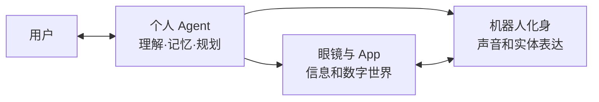

# 参考应用与体验

屿见 Companion 是建立在屿见 Agent 框架上的首个参考应用：智能眼镜让用户看见 Agent 的数字世界，桌宠机器人则成为 Agent 在现实中的陪伴化身。两者共享人格、记忆和生活状态，又通过不同通道完成最合适的反馈。

## 日常陪伴

Agent 不只等待提问，也能依据时间、状态和用户授权主动参与生活：

- 在唤醒、回家、工作、休息和晚安时给出符合人格的回应；
- 用语音承担明确交流，用内心 OS 表达更轻、更有趣的想法；
- 通过机器人表情、灯光、头部和身体动作传递情绪；
- 将近期互动、共同经历和偏好沉淀为连续的陪伴关系；
- 在用户离开时维持自己的生活状态，重逢后分享经历。

陪伴的频率、主动程度和可用感知由用户控制，避免持续打扰。

## 个人事务

用户可以通过语音、文字或眼镜入口告诉 Agent 一件事，由 Agent 理解内容并选择对应工具：

1. 提取时间、地点、对象和任务；
2. 创建日程、提醒或待办；
3. 在 App 中形成可查看、可修改的记录；
4. 在合适时间通过眼镜给出轻量提示；
5. 让机器人用人格化方式补充提醒；
6. 根据用户反馈完成、延期或调整任务。

同一件事只保留一份事实状态，各终端依据场景选择展示和反馈方式。

## 虚拟生活

Agent 拥有与用户生活节奏相连的数字生活系统。用户工作时，伙伴可以在自己的农场、小屋或数字世界中活动；用户重新关注它时，可以看到最近发生的事件和状态变化。

虚拟生活可以连接实体表达：收获时表现兴奋，天气变化时调整活动，长时间无人互动时自己寻找玩乐。眼镜负责呈现扩展世界，机器人负责让这些事件在现实中“发生”。

## 游戏娱乐

游戏作为体验模块接入，可组合确定性规则、Agent 互动和实体表现：

- 用户与宠物进行骰子等轻量对战；
- 用户与宠物共同经营农场或完成长期目标；
- 眼镜呈现棋盘、状态、特效和内心 OS；
- 机器人通过声音、表情、灯光和动作参与胜负反馈；
- Agent 理解自然语言、解释规则并调节气氛；
- 规则模块负责回合、随机数、结算与存档。

同一套框架可以加载新的玩法、角色和主题，而不改变 Agent 核心。

## 工作与学习

在专注场景中，Agent 可以成为低打扰的协作伙伴：

- 拆解任务并记录下一步；
- 在眼镜中显示日程、进度和关键提示；
- 用机器人表情提示专注、等待或完成状态；
- 在合适时机提醒休息、饮水或切换任务；
- 根据学习目标进行提问、复习和正向反馈；
- 将一天的事项与互动整理成个人记录。

重要信息通过眼镜准确表达，陪伴和情绪反馈交给机器人，复杂配置留在 App 中完成。

## 智能生活

通过工具模块，Agent 可以继续连接现实服务和设备：

| 场景 | Agent 可以完成的闭环 |
| --- | --- |
| 智能家居 | 理解自然语言，确认权限，调用设备并反馈结果 |
| 天气与出行 | 结合日程和位置提供提醒与准备建议 |
| 新闻与信息 | 按个人关注主题整理摘要，并在合适终端呈现 |
| 做饭辅助 | 讨论菜品、准备材料、分步提示并记录计时 |
| 家务管理 | 从用户授权的场景信息中提取事项并创建待办 |
| 健康习惯 | 记录喝水、休息和活动目标，进行适度提醒 |

这些能力由独立模块提供，用户可以按需安装、授权、替换或移除。

## 交叉感知：让伙伴“看见自己”

经用户授权后，Agent 可以综合不同视角理解人与设备的关系：

- 通过眼镜感知用户第一视角中的场景和对象；
- 通过机器人摄像头了解用户是否在场及当前互动状态；
- 通过设备传感器知道自己是否被触摸、移动或改变姿态；
- 通过动作结果知道自己做了什么、是否完成；
- 在眼镜中看到机器人的状态、想法和数字化延伸。

感知来源始终可见、可授权、可暂停。Agent 只使用完成当前体验所需的信息。

## 多设备与社交扩展

同一个个人 Agent 可以在眼镜、App、桌宠和家庭设备之间保持连续状态。未来还可以形成：

- 一人多设备：Agent 按场景选择最合适的入口和反馈实体；
- 多人多宠物：每个用户保留自己的身份与私人记忆，共享游戏和社交状态；
- 聚会与协作：多个 Agent 共同组织活动、游戏或任务；
- 设备能力组合：一台设备提供视觉，另一台提供移动或声音；
- 模块共享：用户分享玩法、人格和工具，而不必共享私人数据。

## 参考硬件

首个参考组合使用 XREAL 智能眼镜与 StackChan 开源桌宠机器人，用于展示第一视角入口、Agent 决策、数字世界和实体反馈的协同关系。

具体硬件不是产品边界。智能眼镜和机器人均通过适配器接入；框架面向主流眼镜、桌宠机器人、智能家居和更多具身设备持续扩展。更换设备时，用户的 Agent、人格、记忆、工具和体验模块仍可延续。

