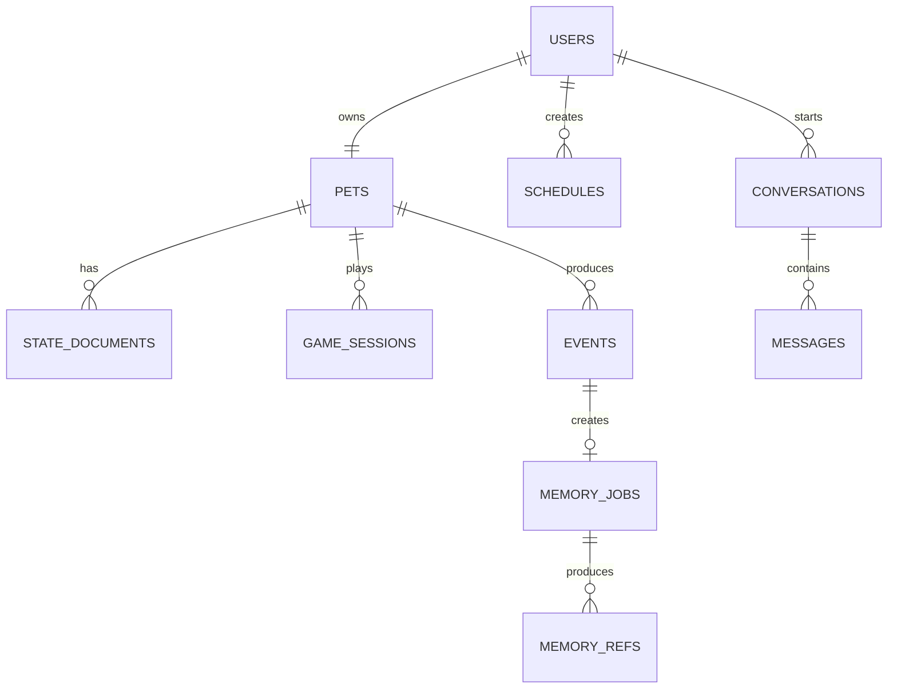
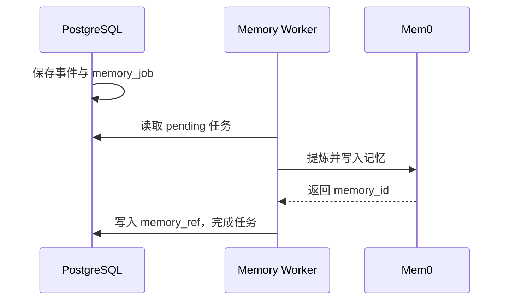

# 数据库设计（MVP）

## 1. 文档目标与 MVP 范围

本文定义首版可演示产品的持久化数据设计。目标是让单个用户的机器人伙伴、虚拟农场、快艇骰子、日程和项目内对话在服务重启后仍可恢复，并为自托管 Mem0 保留可追溯的数据来源。

本期范围：固定单用户、单宠物；宠物与家园状态；机器人自主农场；快艇骰子人机对局；日程提醒；项目内对话原文保存七天；互动事件与长期记忆映射。

本期不实现：账号系统、多用户与多人社交、钱包/商城、智能家居、健康与工作知识库、设备遥测历史、XR 精确空间定位、Unity 离线写入及冲突合并。

## 2. 存储选型与数据边界

| 项目 | 设计 |
| --- | --- |
| 业务数据库 | PostgreSQL；业务事实的唯一来源 |
| 灵活状态 | PostgreSQL `JSONB`；仅用于宠物、家园、农场和游戏局面 |
| 长期记忆 | 自托管 Mem0；由业务事件异步派生，不替代业务数据库 |
| 内容资源 | 仓库 `content/`；数据库只记录资源 ID 与版本，不保存规则、台词、模型原文件 |
| 实时设备状态 | StackChan、NanoDrive 本机；不作为长期业务事实入库 |

数据库保存“可恢复的结果和历史”，不保存摄像头流、串口字节、舵机 PID、当前 WebSocket 连接或逐帧 AR 位姿。

## 3. 数据域、事实来源与所有权

| 数据域 | 主要数据 | 事实来源 | 主责 |
| --- | --- | --- |
| 用户与宠物 | 用户资料、宠物身份、长期状态 | PostgreSQL | B 建模；A 确认客户端字段 |
| 虚拟生活 | 家园、农场、库存、机器人当前农场行为 | PostgreSQL | B 建模；A 确认展示字段 |
| 游戏 | 快艇骰子进行中局面与结果 | PostgreSQL | B 存档模型；A 确认游戏字段 |
| 日程 | 日程与提醒执行状态 | PostgreSQL | B |
| 对话与事件 | 项目内对话、互动、游戏/提醒事件 | PostgreSQL | B |
| 长期记忆 | 偏好、习惯、关系等语义记忆 | Mem0；来源映射在 PostgreSQL | B |

C 提供作物、行为、台词、情绪等内容值；这些值必须引用稳定的 `resourceId`，不决定数据库表结构。

## 4. 数据关系图（ER）



## 5. 表设计

约定：所有主键使用 `UUID`；所有时间使用 `TIMESTAMPTZ` 且以 UTC 写入；表字段使用 `snake_case`；协议与 JSON 使用 `camelCase`。

### 5.1 `users`

首版仅创建一个固定用户，保留本表是为了避免未来扩展时重构所有关联数据。

| 字段 | 类型 | 约束 | 说明 |
| --- | --- | --- | --- |
| `id` | UUID | PK | 用户 ID |
| `display_name` | TEXT | NOT NULL | 展示名 |
| `timezone` | TEXT | NOT NULL，默认 `Asia/Shanghai` | 日程显示时区 |
| `created_at` | TIMESTAMPTZ | NOT NULL | 创建时间 |
| `updated_at` | TIMESTAMPTZ | NOT NULL | 更新时间 |

### 5.2 `pets`

| 字段 | 类型 | 约束 | 说明 |
| --- | --- | --- | --- |
| `id` | UUID | PK | 宠物 ID |
| `user_id` | UUID | FK → `users.id`，UNIQUE，NOT NULL | 首版一人一宠 |
| `name` | TEXT | NOT NULL | 宠物名称 |
| `persona_version` | TEXT | NOT NULL | 人格资源版本 |
| `created_at` | TIMESTAMPTZ | NOT NULL | 创建时间 |
| `updated_at` | TIMESTAMPTZ | NOT NULL | 更新时间 |

### 5.3 `state_documents`

保存当前宠物、家园和农场状态。每个域每只宠物只保留一份当前文档；历史变化通过 `events` 记录，不通过复制整份状态文档实现。

| 字段 | 类型 | 约束 | 说明 |
| --- | --- | --- | --- |
| `id` | UUID | PK | 文档 ID |
| `user_id` | UUID | FK → `users.id`，NOT NULL | 所属用户 |
| `pet_id` | UUID | FK → `pets.id`，NOT NULL | 所属宠物 |
| `domain` | TEXT | CHECK：`pet` / `home` / `farm` | 状态域 |
| `schema_version` | INTEGER | NOT NULL | JSON 结构版本 |
| `revision` | INTEGER | NOT NULL，默认 `1` | 每次写入递增 |
| `data` | JSONB | NOT NULL | 当前状态 |
| `updated_at` | TIMESTAMPTZ | NOT NULL | 最后更新 |

约束：`UNIQUE (pet_id, domain)`。索引：`(user_id, domain)`。

### 5.4 `schedules`

| 字段 | 类型 | 约束 | 说明 |
| --- | --- | --- | --- |
| `id` | UUID | PK | 日程 ID |
| `user_id` | UUID | FK → `users.id`，NOT NULL | 所属用户 |
| `title` | TEXT | NOT NULL | 标题 |
| `description` | TEXT | 可空 | 备注 |
| `starts_at` | TIMESTAMPTZ | NOT NULL | 开始时间 |
| `remind_at` | TIMESTAMPTZ | NOT NULL | 提醒时间 |
| `repeat_type` | TEXT | CHECK：`none` / `daily` / `weekly` | 简单重复规则 |
| `status` | TEXT | CHECK：`active` / `completed` / `cancelled` | 当前状态 |
| `reminded_at` | TIMESTAMPTZ | 可空 | 最近一次已提醒时间 |
| `created_at` | TIMESTAMPTZ | NOT NULL | 创建时间 |
| `updated_at` | TIMESTAMPTZ | NOT NULL | 更新时间 |

索引：`(user_id, starts_at)`；对 `status = 'active'` 的 `(remind_at)` 建部分索引。

### 5.5 `game_sessions`

保存一次游戏的当前局面和最终结果。首版 `game_type` 只允许 `yahtzee`。

| 字段 | 类型 | 约束 | 说明 |
| --- | --- | --- | --- |
| `id` | UUID | PK | 对局 ID |
| `user_id` | UUID | FK → `users.id`，NOT NULL | 玩家 |
| `pet_id` | UUID | FK → `pets.id`，NOT NULL | 机器人对手 |
| `game_type` | TEXT | CHECK：`yahtzee` | 游戏类型 |
| `schema_version` | INTEGER | NOT NULL | 局面结构版本 |
| `status` | TEXT | CHECK：`playing` / `completed` / `abandoned` | 对局状态 |
| `state` | JSONB | NOT NULL | 当前局面 |
| `result` | JSONB | 可空 | 最终结果 |
| `started_at` | TIMESTAMPTZ | NOT NULL | 开局时间 |
| `updated_at` | TIMESTAMPTZ | NOT NULL | 最后保存时间 |
| `ended_at` | TIMESTAMPTZ | 可空 | 结束时间 |

索引：`(pet_id, status, updated_at DESC)`；`(user_id, started_at DESC)`。

### 5.6 `conversations`

| 字段 | 类型 | 约束 | 说明 |
| --- | --- | --- | --- |
| `id` | UUID | PK | 会话 ID |
| `user_id` | UUID | FK → `users.id`，NOT NULL | 所属用户 |
| `pet_id` | UUID | FK → `pets.id`，NOT NULL | 对话对象 |
| `channel` | TEXT | CHECK：`unity_text` / `unity_voice` / `stackchan` | 对话入口 |
| `message_count` | INTEGER | NOT NULL，默认 `0` | 原文条数 |
| `started_at` | TIMESTAMPTZ | NOT NULL | 开始时间 |
| `ended_at` | TIMESTAMPTZ | 可空 | 结束时间 |

只有项目实际接入且取得的对话原文才能写入本表及 `messages`；现有小智对话尚未桥接时不得假定已保存。

### 5.7 `messages`

| 字段 | 类型 | 约束 | 说明 |
| --- | --- | --- | --- |
| `id` | UUID | PK | 消息 ID |
| `conversation_id` | UUID | FK → `conversations.id`，NOT NULL | 所属会话 |
| `role` | TEXT | CHECK：`user` / `assistant` / `system` | 发言角色 |
| `content` | TEXT | NOT NULL | 原始文本 |
| `created_at` | TIMESTAMPTZ | NOT NULL | 创建时间 |
| `expires_at` | TIMESTAMPTZ | NOT NULL | 原文删除时间 |

索引：`(conversation_id, created_at)`；`(expires_at)`。

### 5.8 `events`

记录有业务意义的历史事件，用于日记素材、调试、记忆提炼和状态变化追溯；不是设备遥测日志。

| 字段 | 类型 | 约束 | 说明 |
| --- | --- | --- | --- |
| `id` | UUID | PK | 事件 ID |
| `user_id` | UUID | FK → `users.id`，NOT NULL | 所属用户 |
| `pet_id` | UUID | FK → `pets.id`，NOT NULL | 所属宠物 |
| `event_type` | TEXT | NOT NULL | 事件类型 |
| `source` | TEXT | CHECK：`unity` / `agent` / `stackchan` / `system` | 事件来源 |
| `payload` | JSONB | NOT NULL，默认 `{}` | 补充信息 |
| `occurred_at` | TIMESTAMPTZ | NOT NULL | 实际发生时间 |
| `created_at` | TIMESTAMPTZ | NOT NULL | 入库时间 |

首版事件类型：`interaction.feed`、`interaction.touch`、`schedule.triggered`、`schedule.acknowledged`、`game.completed`、`conversation.completed`、`farm.activity_changed`、`pet.mood_changed`。

索引：`(pet_id, occurred_at DESC)`；`(event_type, occurred_at DESC)`。

### 5.9 `memory_jobs`

| 字段 | 类型 | 约束 | 说明 |
| --- | --- | --- | --- |
| `id` | UUID | PK | 任务 ID |
| `source_event_id` | UUID | FK → `events.id`，UNIQUE，NOT NULL | 待提炼事件 |
| `status` | TEXT | CHECK：`pending` / `processing` / `completed` / `failed` / `ignored` | 任务状态 |
| `attempts` | INTEGER | NOT NULL，默认 `0` | 已尝试次数 |
| `next_retry_at` | TIMESTAMPTZ | 可空 | 下次重试时间 |
| `last_error` | TEXT | 可空 | 最近失败原因 |
| `created_at` | TIMESTAMPTZ | NOT NULL | 创建时间 |
| `completed_at` | TIMESTAMPTZ | 可空 | 完成时间 |

索引：对 `status IN ('pending', 'failed')` 的 `next_retry_at` 建部分索引。

### 5.10 `memory_refs`

| 字段 | 类型 | 约束 | 说明 |
| --- | --- | --- | --- |
| `id` | UUID | PK | 映射 ID |
| `memory_job_id` | UUID | FK → `memory_jobs.id`，NOT NULL | 来源任务 |
| `user_id` | UUID | FK → `users.id`，NOT NULL | Mem0 检索范围 |
| `mem0_memory_id` | TEXT | UNIQUE，NOT NULL | Mem0 返回的记忆 ID |
| `memory_bucket` | TEXT | NOT NULL | `profile` / `preference` / `habit` / `relationship` / `goal` / `milestone` |
| `created_at` | TIMESTAMPTZ | NOT NULL | 创建时间 |

## 6. JSONB 状态结构与 Schema 版本

`state_documents.data` 与 `game_sessions.state` 不是自由格式。每次结构变化必须提高 `schema_version`，在 `packages/protocol/schemas/` 提供机器可读 Schema 和示例，并由迁移或服务层完成兼容。

### 6.1 `pet`

```json
{
  "mood": "happy",
  "energy": 75,
  "intimacy": 20,
  "lastInteractionAt": "2026-08-07T10:00:00Z"
}
```

`mood` 为 `neutral`、`happy`、`sad`、`angry`、`surprised` 之一；`energy` 为 `0`–`100`；`intimacy` 为非负整数。

### 6.2 `home`

```json
{
  "activeThemeResourceId": "home.default",
  "unlockedResourceIds": [],
  "displaySettings": {}
}
```

首版不保存精确 AR 锚点或自由摆放坐标；仅保留家园主题和已解锁内容引用。

### 6.3 `farm`

```json
{
  "plots": [
    {
      "id": "plot-0-0",
      "cropId": "crop.tomato",
      "stage": "sprout",
      "stageStartedAt": "2026-08-07T10:00:00Z",
      "waterCount": 1
    }
  ],
  "inventory": { "crop.tomato": 2 },
  "currentActivity": "watering",
  "lastTickAt": "2026-08-07T10:00:00Z"
}
```

`currentActivity` 限定为 `idle`、`planting`、`watering`、`harvesting`、`resting`。服务端以 `lastTickAt` 推进农场时间；数据库只记录状态，不规定 Unity 或实体机器人的表现方式。

### 6.4 `yahtzee` 对局状态

```json
{
  "round": 1,
  "isUserTurn": true,
  "dice": [1, 2, 3, 4, 5],
  "keep": [false, false, true, false, false],
  "rollsThisTurn": 1,
  "userScores": {},
  "petScores": {}
}
```

首版使用五颗骰子、每回合最多三次投掷。具体计分规则属于游戏实现；存档必须能恢复 A 当前游戏逻辑所需的全部局面字段。

## 7. 数据一致性、事务与版本规则

- PostgreSQL 是业务状态唯一来源；设备动作与 AR 当前追踪不是数据库事实。
- 所有 `updated_at` 由服务端写入；农场推进以服务端 UTC 时间为准。
- 写入 `state_documents` 时 `revision` 递增。首版不实现离线冲突合并，但保留版本字段以避免未来无条件覆盖。
- 创建事件及其 `memory_jobs` 必须在同一数据库事务内完成。
- 保存消息时，新增 `messages`、更新 `conversations.message_count` 必须在同一事务内完成。
- `game_sessions.status = 'completed'` 时必须写入 `result` 和 `ended_at`；进行中局面只能覆盖同一对局的 `state`。
- 日程提醒状态更新必须同时写入 `status` 或 `reminded_at`，并生成对应事件。

## 8. 索引与主要查询路径

| 查询 | 支撑索引 |
| --- | --- |
| 应用启动读取用户、宠物和三类状态 | `pets.user_id`、`state_documents (user_id, domain)` |
| 查询待提醒日程 | `schedules` 的活动提醒部分索引 |
| 恢复最近未完成骰子对局 | `game_sessions (pet_id, status, updated_at DESC)` |
| 显示一段对话 | `messages (conversation_id, created_at)` |
| 清理到期原文 | `messages (expires_at)` |
| 获取宠物近期事件 | `events (pet_id, occurred_at DESC)` |
| Worker 获取待处理记忆任务 | `memory_jobs` 的待处理部分索引 |

首版不为 JSONB 建通用 GIN 索引；只有出现明确查询需求后才增加针对性索引。

## 9. 数据保留、清理与恢复规则

| 数据 | 规则 |
| --- | --- |
| `messages.content` | 创建后七天硬删除 |
| `conversations` 元数据 | 保留会话时间、渠道与消息数，不保留已删除原文 |
| 日程、游戏结果、农场/宠物当前状态 | MVP 内长期保留 |
| `events`、`memory_jobs`、`memory_refs` | MVP 内长期保留，用于追溯和修正记忆 |
| 实时设备数据 | 不入库 |

原文到期时，即使 Mem0 任务失败也必须删除 `messages`；失败任务保留错误状态和来源事件，但不保留原文副本。

开发环境可通过 `pg_dump` 生成人工备份；生产备份、用户删除流程和权限体系不属于首版实现，但不得在迁移中破坏可恢复性。

## 10. Mem0 数据映射与失败处理

Mem0 是自托管的长期语义记忆服务。业务数据库保存原始事实、任务和映射；Mem0 保存经筛选后的偏好、习惯、关系、目标与里程碑。



- 日程时间、游戏分数、农场数值、设备实时状态不得写入 Mem0。
- 对话在一轮“用户输入 + Agent 回复”完整结束后生成记忆任务，不按单条消息逐条提炼。
- 每个 Mem0 写入必须携带固定 `user_id`，并通过 `memory_refs` 关联来源。
- Mem0 不可用时，业务数据仍必须正常写入 PostgreSQL；任务标记失败并按 `next_retry_at` 重试。
- Mem0 的内部表、模型与部署配置不属于本数据库 Schema；业务侧只依赖 `memory_refs`。

## 11. 迁移、初始化数据与环境约定

- 使用 Alembic 管理 PostgreSQL Schema；每次结构变更新增迁移，不修改已执行迁移。
- 空数据库必须可按迁移顺序创建全部 MVP 表、索引和约束。
- 初始化脚本创建一个固定 `users` 记录、一只 `pets` 记录，以及 `pet`、`home`、`farm` 三份默认状态文档。
- 数据库连接、Mem0 地址和密钥仅由服务端环境变量提供；客户端不直接持有。
- 开发、测试、部署环境使用独立数据库；测试必须可从空库重复执行。

## 12. MVP 数据库验收条件

- 空数据库可完成全部迁移与初始化。
- 固定用户、宠物和三类状态可保存、读取并在重启后恢复。
- 农场状态可根据 `lastTickAt` 被服务端正确推进并保存。
- 快艇骰子进行中局面和最终结果可保存、恢复和查询。
- 日程可创建、修改、取消，并记录提醒执行状态。
- 对话原文可保存；七天后清理任务仅删除原文而保留会话元数据。
- 事件和记忆任务可在同一事务中写入。
- Mem0 停机时，业务数据库读写不受影响；恢复后任务可重试并记录 `memory_refs`。
- 所有 JSONB 状态都有版本、Schema 与示例，且与 Unity 使用字段一致。

## 13. 变更记录

| 版本 | 日期 | 内容 |
| --- | --- | --- |
| `v0.1` | 2026-08-06 | 建立单用户 MVP 数据库、七天对话保留和自托管 Mem0 边界 |
| `v0.2` | 2026-08-07 | 按 MVP 完整数据库设计补齐数据域、表、状态结构、一致性、索引、生命周期与迁移规则 |
